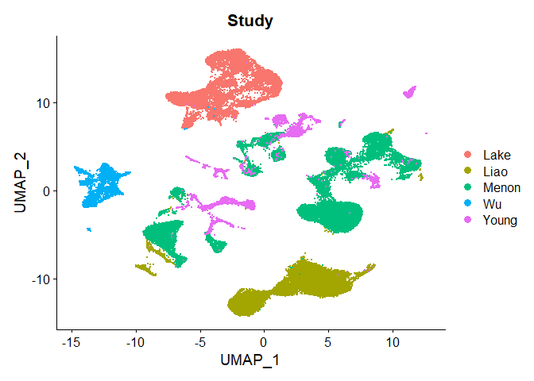
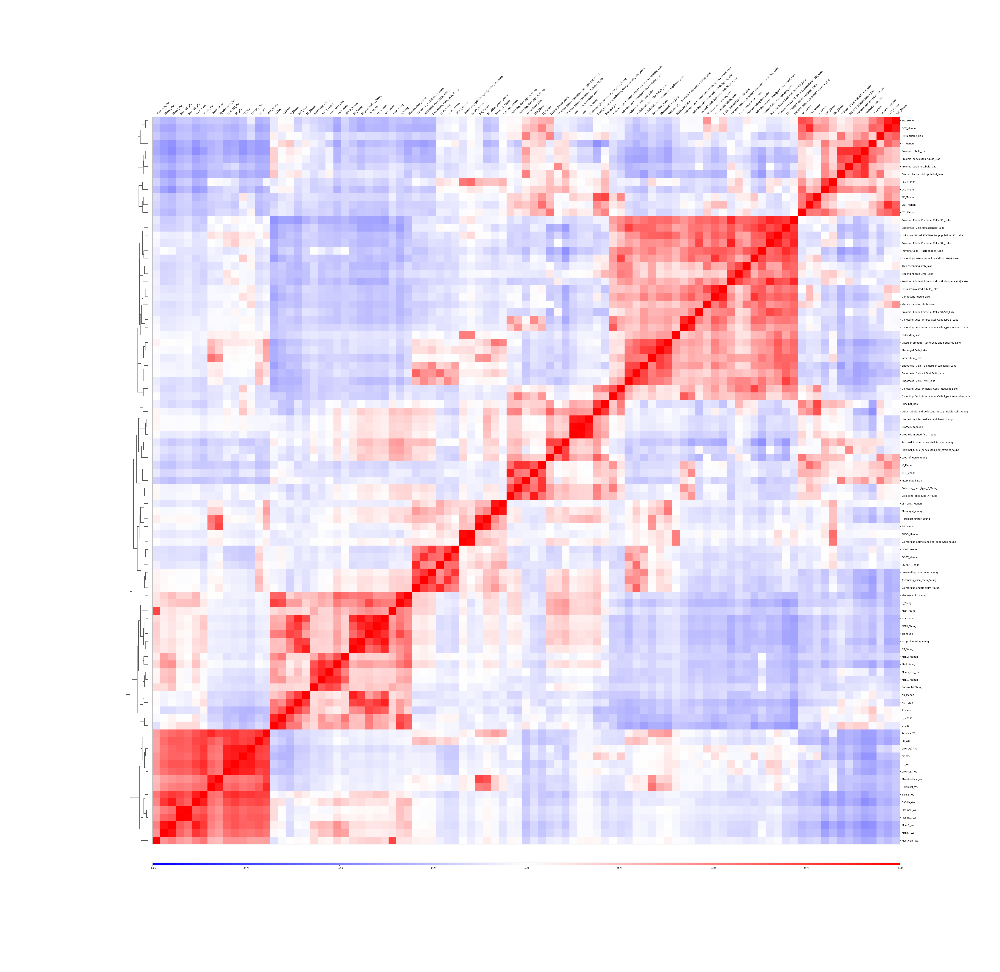
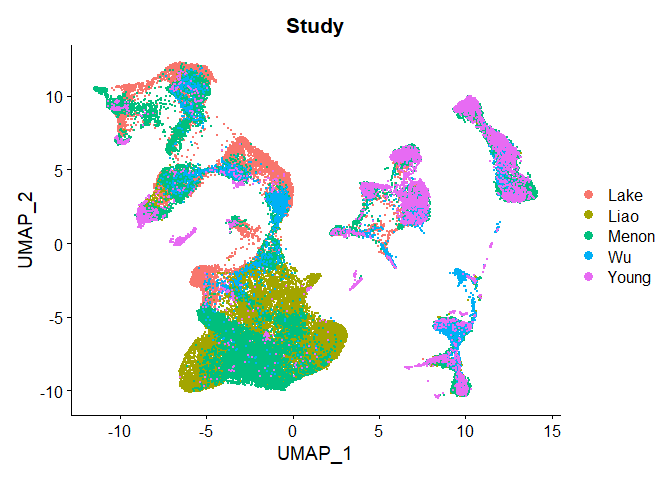
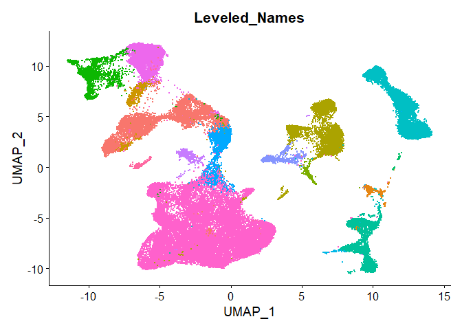

R Notebook
================

### This notebook will reproduce the figures in the manuscript associated with this Github repository, starting from MergedObject.RDS, which is downloaded automatically from Zenodo. Please note that Table 1 and Figures 1a, 1b, 1c, 2a, and 2b were created in Excel, but information for their recreation will be included here. Additionally, the machine learning algorithms for figure 4 requires a lengthy amount of time to run, so this recreation uses pre-computed confusion matricies, which can be downloaded automatically from the link in this notebook or found as an Excel document as Supplementary File \#4. Finally, the output of our SVM quality control is also downloaded as a pre-computed csv object. These objects can readily be computed with the snakemake workflow also included in this repository.

#### Table 1.

This table was created with information found in the original studies
for each dataset. The indicated cell count is post-quality control.
Additionally, the Sampling Location, Age, and Sex columns include only
known values for known samples, as several of the samples did not
provide this information.

#### Figures 1a : 1c

Each pie chart uses values that can be found in the “Metadata by Sample”
page of Supplementary File 3. Cells with unknown values are excluded
from each chart.

#### Figures 2b : 2c

Each bar graph uses data which can be found on the “Leveled Names by
Study” page of Supplementary File 3. Totals are used for 2b, and the
values from the matrix are used for 2c.

``` r
download.file('https://zenodo.org/record/4701852/files/MergedObject.RDS?download=1', 'MergedObject.RDS', method='curl')
```

``` r
sobjm <- readRDS('MergedObject.RDS')
library(Seurat)
```

    ## Warning: package 'Seurat' was built under R version 4.0.4

    ## Warning: replacing previous import 'spatstat.utils::RelevantNA' by
    ## 'spatstat.sparse::RelevantNA' when loading 'spatstat.core'

    ## Warning: replacing previous import 'spatstat.utils::grokIndexVector' by
    ## 'spatstat.sparse::grokIndexVector' when loading 'spatstat.core'

    ## Warning: replacing previous import 'spatstat.utils::fullIndexSequence' by
    ## 'spatstat.sparse::fullIndexSequence' when loading 'spatstat.core'

    ## Warning: replacing previous import 'spatstat.utils::positiveIndex' by
    ## 'spatstat.sparse::positiveIndex' when loading 'spatstat.core'

    ## Warning: replacing previous import 'spatstat.utils::replacementIndex' by
    ## 'spatstat.sparse::replacementIndex' when loading 'spatstat.core'

    ## Warning: replacing previous import 'spatstat.utils::RelevantEmpty' by
    ## 'spatstat.sparse::RelevantEmpty' when loading 'spatstat.core'

    ## Warning: replacing previous import 'spatstat.utils::isRelevantZero' by
    ## 'spatstat.sparse::isRelevantZero' when loading 'spatstat.core'

    ## Warning: replacing previous import 'spatstat.utils::logicalIndex' by
    ## 'spatstat.sparse::logicalIndex' when loading 'spatstat.core'

    ## Warning: replacing previous import 'spatstat.utils::RelevantZero' by
    ## 'spatstat.sparse::RelevantZero' when loading 'spatstat.core'

    ## Warning: replacing previous import 'spatstat.utils::strictIndexSequence' by
    ## 'spatstat.sparse::strictIndexSequence' when loading 'spatstat.core'

    ## Warning: replacing previous import 'spatstat.utils::RelevantNA' by
    ## 'spatstat.sparse::RelevantNA' when loading 'spatstat.geom'

    ## Warning: replacing previous import 'spatstat.utils::grokIndexVector' by
    ## 'spatstat.sparse::grokIndexVector' when loading 'spatstat.geom'

    ## Warning: replacing previous import 'spatstat.utils::fullIndexSequence' by
    ## 'spatstat.sparse::fullIndexSequence' when loading 'spatstat.geom'

    ## Warning: replacing previous import 'spatstat.utils::positiveIndex' by
    ## 'spatstat.sparse::positiveIndex' when loading 'spatstat.geom'

    ## Warning: replacing previous import 'spatstat.utils::replacementIndex' by
    ## 'spatstat.sparse::replacementIndex' when loading 'spatstat.geom'

    ## Warning: replacing previous import 'spatstat.utils::RelevantEmpty' by
    ## 'spatstat.sparse::RelevantEmpty' when loading 'spatstat.geom'

    ## Warning: replacing previous import 'spatstat.utils::isRelevantZero' by
    ## 'spatstat.sparse::isRelevantZero' when loading 'spatstat.geom'

    ## Warning: replacing previous import 'spatstat.utils::logicalIndex' by
    ## 'spatstat.sparse::logicalIndex' when loading 'spatstat.geom'

    ## Warning: replacing previous import 'spatstat.utils::RelevantZero' by
    ## 'spatstat.sparse::RelevantZero' when loading 'spatstat.geom'

    ## Warning: replacing previous import 'spatstat.utils::strictIndexSequence' by
    ## 'spatstat.sparse::strictIndexSequence' when loading 'spatstat.geom'

    ## Attaching SeuratObject

``` r
sobjm <- FindVariableFeatures(sobjm)
sobjm <- ScaleData(sobjm)
```

    ## Centering and scaling data matrix

``` r
sobjm <- RunPCA(sobjm)
```

    ## PC_ 1 
    ## Positive:  SRGN, HLA-DPB1, JUNB, HLA-DPA1, HLA-DRB1, CD74, FOS, HLA-DRA, ZFP36, DUSP1 
    ##     TYROBP, HLA-DQA1, FOSB, LAPTM5, JUN, MT-RNR2, CTSS, HSPA1A, MT-ATP8, MTND1P23 
    ##     HLA-DRB5, FP671120.1, PTPRC, MTCO1P12, PPP1R15A, LINC01317, VIM, MTCO1P40, S100A4, MT-RNR1 
    ## Negative:  FXYD2, CRYAB, FABP1, GSTA2, ATP1B1, PCP4, SLC5A12, RBP4, AC093496.1, KRT18 
    ##     AC013463.2, PTH2R, PTGER3, SLC12A1, AFM, KRT8, EPCAM, DEFB1, PRAP1, SLC22A7 
    ##     RP11-556I14.1, EGF, ADIRF, SLC17A1, KNG1, IL36B, RP11-368L12.1, CA12, EFNA5, ITGB6 
    ## PC_ 2 
    ## Positive:  RPL39, RPS18, RPS10, RPL28, RPS2, RPS3, RPL36A, RPL17, RPL37, RPS21 
    ##     S100A4, CORO1A, HNRNPA1, GNB2L1, HCST, NKG7, RPSA, RPL37A, CD52, EMP3 
    ##     AC090498.1, GLTSCR2, CD48, CYTIP, CST7, GNLY, PLAC8, PRF1, GZMB, RPS17 
    ## Negative:  MT-RNR2, FP671120.1, LINC01317, MTND1P23, FP671120.4, MTCO1P12, MT-RNR1, MTATP6P1, MTCO1P40, DLG2 
    ##     FP236383.1, MTND2P28, AL669831.3, PDE3A, HFM1, DHFR, MTCO2P12, STEAP1B, MT-ATP8, MTRNR2L12 
    ##     NBPF19, AC138123.2, MTCO3P12, MTND4P12, AC073621.1, EEF1A1P12, DGKI, MIR4300HG, ANKRD30BL, PYY 
    ## PC_ 3 
    ## Positive:  TIMP3, RAMP2, IFI27, IGFBP5, GNG11, SDPR, CD9, SLC9A3R2, EMCN, ID1 
    ##     EPAS1, PLAT, MGP, NPDC1, TM4SF1, PTPRB, HYAL2, ENG, TMEM204, NOTCH4 
    ##     SPARC, RNASE1, CRHBP, PLPP1, RAMP3, PTRF, A2M, FLT1, ADGRF5, MEIS2 
    ## Negative:  TYROBP, PTPRC, LAPTM5, CORO1A, HCST, ITGB2, FCER1G, LCP1, CD52, CXCR4 
    ##     LSP1, FCGR3A, CD48, LST1, CYTIP, EVI2B, CTSS, PLAC8, MS4A7, AIF1 
    ##     FCN1, CCL5, PLEK, MT-RNR2, MTRNR2L8, GZMA, CST7, C1orf162, NKG7, SPI1 
    ## PC_ 4 
    ## Positive:  FXYD3, S100P, KRT19, KRT13, KRT17, TACSTD2, AQP3, SPINK1, FABP5, PSCA 
    ##     DHRS2, GPX2, AGR2, S100A2, KRT7, PERP, PHLDA2, SFN, VSIG2, RP11-44F21.5 
    ##     BMP3, ELF3, AKR1C2, PLA2G2A, SERPINB5, FAM3B, GDF15, KRT5, CLDN4, SYT8 
    ## Negative:  IFI27, RAMP2, RNASE1, SLC9A3R2, PLAT, EMCN, NOTCH4, PTPRB, CRHBP, ENG 
    ##     SDPR, RAMP3, SPARC, IGFBP5, HYAL2, TMEM88, NPDC1, GNG11, TMEM204, MGP 
    ##     FLT1, CD34, FCN3, TM4SF1, TIMP3, CLEC14A, EPAS1, PLVAP, A2M, SLCO2A1 
    ## PC_ 5 
    ## Positive:  AC013463.2, PTH2R, ERBB4, MAGI2, NEAT1, PARD3B, AP000769.1, PRKG1, DST, KCNIP4 
    ##     EFNA5, MACROD2, COL4A3, KCNQ1OT1, NLGN1, PTGER3, CACNA2D3, RP11-368L12.1, PTPRO, RP11-123O10.4 
    ##     AIF1, PLA2R1, GPC6, PDE10A, FCER1G, PLCB1, AC012593.1, LST1, RALYL, ITGB6 
    ## Negative:  MT-ND3, MT-ND1, RPL37A, RPS18, RPL28, MT-ND5, RPL37, ADIRF, FXYD2, HSPB1 
    ##     RPL39, S100P, RPS3, FXYD3, KRT13, GPX2, SNCG, FABP1, KRT17, C19orf33 
    ##     CRYAB, DHRS2, PSCA, RPS21, MT-ND4L, MTRNR2L12, FABP5, HNRNPA1, RP11-44F21.5, GSTA2

``` r
sobjm <- RunUMAP(sobjm, dims = 1:30)
```

    ## Warning: The default method for RunUMAP has changed from calling Python UMAP via reticulate to the R-native UWOT using the cosine metric
    ## To use Python UMAP via reticulate, set umap.method to 'umap-learn' and metric to 'correlation'
    ## This message will be shown once per session

    ## 08:36:13 UMAP embedding parameters a = 0.9922 b = 1.112

    ## 08:36:13 Read 62293 rows and found 30 numeric columns

    ## 08:36:13 Using Annoy for neighbor search, n_neighbors = 30

    ## 08:36:13 Building Annoy index with metric = cosine, n_trees = 50

    ## 0%   10   20   30   40   50   60   70   80   90   100%

    ## [----|----|----|----|----|----|----|----|----|----|

    ## **************************************************|
    ## 08:36:22 Writing NN index file to temp file C:\Users\adamt\AppData\Local\Temp\RtmpSIajFD\filea9b02683da5
    ## 08:36:22 Searching Annoy index using 1 thread, search_k = 3000
    ## 08:36:49 Annoy recall = 100%
    ## 08:36:50 Commencing smooth kNN distance calibration using 1 thread
    ## 08:36:54 Initializing from normalized Laplacian + noise
    ## 08:37:07 Commencing optimization for 200 epochs, with 2776636 positive edges
    ## 08:38:34 Optimization finished

### Figure 3a, part 1

``` r
DimPlot(sobjm, group.by = 'Study')
```

<!-- -->

``` r
reticulate::use_python('/Users/adamt/anaconda3/envs/test/python.exe', required = TRUE)
library(reticulate)

sceasy::convertFormat(sobjm, from = 'seurat', to = 'anndata', outFile = 'integratedobject.h5ad')
```

    ## AnnData object with n_obs × n_vars = 62293 × 45662
    ##     obs: 'nCount_RNA', 'nFeature_RNA', 'Original_Cell_Types', 'Leveled_Names', 'Study', 'percent.mt', 'Sex', 'Sampling_Location', 'Participant', 'Sample', 'Age'
    ##     var: 'vst.mean', 'vst.variance', 'vst.variance.expected', 'vst.variance.standardized', 'vst.variable'
    ##     obsm: 'X_pca', 'X_umap'

### Figure 2a.

``` python
import os
os.environ['QT_QPA_PLATFORM_PLUGIN_PATH'] = '/Users/adamt/anaconda3/Library/plugins/platforms'

import scanpy as sc
anndata = sc.read('integratedobject.h5ad')

sc.pl.correlation_matrix(anndata, 'Original_Cell_Types')
```

    ## WARNING: dendrogram data not found (using key=dendrogram_Original_Cell_Types). Running `sc.tl.dendrogram` with default parameters. For fine tuning it is recommended to run `sc.tl.dendrogram` independently.



``` r
sobjmlist <- SplitObject(sobjm, split.by = 'Study')
rm(sobjm)

sobjmlist <- lapply(X = sobjmlist, FUN = function(x) {
  x <- NormalizeData(x)
  x <- FindVariableFeatures(x, selection.method = "vst", nfeatures = 2000)
})

features <- SelectIntegrationFeatures(object.list = sobjmlist)

sobjmlist <- lapply(X = sobjmlist, FUN = function(x) {
  x <- ScaleData(x, features = features)
  x <- RunPCA(x, features = features)
})
```

    ## Centering and scaling data matrix

    ## Warning in PrepDR(object = object, features = features, verbose = verbose): The
    ## following 123 features requested have zero variance (running reduction without
    ## them): TPSAB1, RGS5, IGKC, IGLL5, LYPD2, C11orf96, IL1RL1, HSPA6, GZMH, MT-
    ## ND1, CD79A, MT1H, IFI30, IFNG, XCL2, RIPPLY1, MS4A7, CLIC3, XCL1, TREM2, SAA2,
    ## MT-CO3, CCL3L3, MT-ND4, KLRC2, CD3E, CRIP1, CTSG, CYBB, TRDC, MT1F, APOBEC3C,
    ## CSF2RA, HIST1H1C, LTC4S, P2RY13, VPREB3, FXYD1, TPSB2, MALAT1, NKG7, TCL1A,
    ## MT-ND3, MT1X, S100B, CD1C, MT-ATP6, MT-CO2, MT-CO1, CCL19, AL928768.3, KRT13,
    ## CCL22, MT-CYB, HAMP, MT-ND4L, MT-ND5, LY6D, CCL3L1, IGFL1, MT-ND2, IL17A,
    ## ATP2B1-AS1, NUPR2, TRGC1, GZMM, EGOT, SOX18, ADA2, IFITM1, HIST1H2BC, CD207,
    ## LRRC26, AL034397.3, RP6-91H8.3, SCT, FFAR3, JAML, CMA1, AC114760.2, AC073335.2,
    ## KRT1, GPR42, HILPDA, APOA2, AC013652.1, CAPS, CAPN3, SLC23A3, XCR1, UPK1A,
    ## RP11-291B21.2, AC105999.2, AKR1C3, ZBP1, AC019197.1, LILRA6, AL390719.2,
    ## AL359915.1, SGK494, CXCR3, XIRP1, CFAP65, CSF2, RP13-463N16.6, SIGLEC8, FCGR1B,
    ## HOXB9, C1QTNF3, SLC5A3, HOXC8, POU3F3, CD1B, HOXB8, RETREG1, TNFSF18, CD19,
    ## HOXB5, CTLA4, NMRK2, LINC02294, CYP1A2, AC090152.1

    ## PC_ 1 
    ## Positive:  CUBN, ACSM2A, ACSM2B, SLC5A12, SLC13A3, PTH1R, LRP2, SLC17A1, MME, TRPM3 
    ##     SLC16A9, SLC2A9, SLC13A1, ALDOB, AFM, ENPEP, RAB11FIP3, PLG, PTH2R, LINC01060 
    ##     NHS, TINAG, NOX4, MAGI2, DPYS, GPX3, AGXT2, SLC4A4, GLYAT, PAH 
    ## Negative:  SPP1, GSTP1, CD24, SOD2, EEF1A1, TXNIP, EPCAM, S100A10, B2M, PRDX1 
    ##     ITGB6, S100A6, CRYAB, SAT1, SLPI, LDHA, WFDC2, AQP2, C8orf4, PEBP1 
    ##     IGFBP7, KRT18, FTL, IFITM3, RASD1, CD63, HSP90AA1, TACSTD2, ID1, GDF15 
    ## PC_ 2 
    ## Positive:  PKHD1, SLC16A12, ESRRG, ACSM2A, AFM, SLC13A3, LINC01320, CUBN, SLC5A12, PTH2R 
    ##     ACSM2B, PLG, SLC2A9, SLC12A1, SLC17A1, PAX8, TRABD2B, LINC01060, RAB11FIP3, CLDN10 
    ##     SLC16A9, BICC1, LRP2, UMOD, NHS, SLC13A1, EGF, GALNT14, CASR, KCNJ15 
    ## Negative:  PODXL, PTPRO, PLA2R1, CLIC5, NPHS2, PTPRQ, NTNG1, NPHS1, MEIS2, SPARC 
    ##     TIMP3, RBMS3, FGF1, SPOCK2, FMN2, NFASC, EMCN, NES, SULF1, CTGF 
    ##     FOSB, HSPA1A, A2M, RP11-550H2.2, SPOCK1, TMTC1, KLF2, IGFBP5, TARID, HTRA1 
    ## PC_ 3 
    ## Positive:  AQP2, ST6GAL1, AQP3, FXYD4, HSD11B2, C1orf168, PAPPA, KRT19, TSPAN1, BMPR1B 
    ##     PWRN1, TMSB4X, SLC4A4, GATA3, BTG2, PIK3C2G, CTSH, AC013463.2, TRPM3, SCNN1G 
    ##     SLC38A1, PRKAG2, SPTBN2, SLC26A7, ATP6V0D2, PTGER1, EYA4, RALBP1, TMEM213, KCNJ15 
    ## Negative:  UMOD, PLCB1, SLC12A1, C8orf4, SLC4A7, KNG1, CASR, SPP1, SERPINA1, ADAMTS1 
    ##     EGF, GOLM1, ITGB6, EMP1, EFNA5, ALDH1A2, PPP1R1A, CPM, PCDH9, FOXP2 
    ##     RANBP3L, ZNF385D, PLAU, PROX1, NTRK2, SNED1, CLCNKA, TGM2, G0S2, MFSD4 
    ## PC_ 4 
    ## Positive:  SPP1, SERPINA1, SOD2, ADAMTS1, TNFSF10, CRYAB, SLPI, C8orf4, TGM2, ITGB6 
    ##     IFITM3, UGT2B7, SLC34A2, CPE, ERRFI1, ACSM2A, TNFRSF11B, ACSM2B, SLC5A12, TIMP1 
    ##     KRT18, VCAM1, CDH6, SLC13A3, LRP2, LDHA, CUBN, SLC17A1, LINC01320, MT2A 
    ## Negative:  PTGER3, ERBB4, AC013463.2, EGF, MECOM, ESRRG, CLCNKB, SLC12A1, TMEM72, PDE1A 
    ##     CLCNKA, CA12, UMOD, ATP1B1, CASR, CLNK, SLC26A7, MFSD4, COBLL1, KCNJ1 
    ##     KNG1, DEFB1, KCNIP4, ATP6V0D2, PPARGC1A, TMEM213, PACRG, ATP6V0A4, RAP1GAP, CKB 
    ## PC_ 5 
    ## Positive:  PTPRQ, NPHS2, PTPRO, CLIC5, NPHS1, NTNG1, PLA2R1, FMN2, RP11-550H2.2, FGF1 
    ##     DPP6, SPOCK2, CR1, TARID, ZNF804A, MAGI2, NPNT, C14orf37, SEMA5A, NDNF 
    ##     PCOLCE2, PODXL, DACH1, MME, CTGF, PTGDS, NFASC, NECAB1, TYRO3, WT1 
    ## Negative:  EMCN, MEIS2, LDB2, RBMS3, EBF1, EPAS1, PTPRB, IGFBP5, FLT1, A2M 
    ##     TMTC1, MEF2C, ADGRF5, PECAM1, ENG, PLAT, ITGA8, KLF2, HSPA1A, EGFL7 
    ##     TEK, TCF4, RAPGEF4, ADGRL4, TIMP3, SLC2A3, FOSB, SHANK3, CD34, LRRC32 
    ## Centering and scaling data matrix

    ## Warning in PrepDR(object = object, features = features, verbose = verbose): The
    ## following 513 features requested have zero variance (running reduction without
    ## them): TPSAB1, DCN, SLC12A3, IGLL5, CPA3, ACKR1, MYH11, EMCN, PLN, FCER1A,
    ## PLA2G2A, NPHS2, MFAP5, FABP4, SELE, C7, CALB1, PSCA, FCN3, C11orf96, COL1A1,
    ## COL1A2, IL1RL1, MKI67, IGF2, SAA1, LUM, SFRP2, FGF1, PTPRO, RERGL, CCL8, CRABP2,
    ## PCOLCE2, SLC26A4, CXCL9, RP11-396O20.1, POSTN, MMRN1, CLDN5, IL13RA2, CCL23,
    ## CHI3L1, FBLN1, FLT1, UBE2C, RHCG, TCF21, STAP1, CXCL3, ERBB4, CALCA, COL3A1,
    ## PLAC9, HPGDS, CLNK, TOP2A, ESM1, RP11-550H2.2, SLC4A9, HLA-DQA2, SLC14A1, A2M,
    ## TNNT2, NDNF, MCAM, XCL1, PWRN1, CXCL11, REN, OLFM4, ADH1B, FRZB, PLAT, PDGFRB,
    ## TREM2, SCARA5, CCDC80, OLFM3, MFAP4, C10orf10, COL6A3, CAV1, VWF, SRPX, DDN,
    ## HDC, SAA2, IDO1, PI16, RGS13, CCL3L3, FBLN2, LIF, NTNG1, NTS, SOST, VSIG4,
    ## MFGE8, IL6, SEMA3G, FOXI1, DPT, PTX3, C1orf186, SOX17, CXCL6, KCNT2, CENPF,
    ## EDN2, EBI3, SYNPO2, SERPINE1, CRB2, C8orf4, CA8, CTSG, ELN, OLR1, LINC00551,
    ## RP5-887A10.1, OGN, DES, BTNL9, LAMC2, KRT17, EGR3, EHD3, MFSD4, IL33, SFN, NES,
    ## KCNE4, ITGA8, IGHGP, LAMP3, ACPP, GJA5, F3, LINC00839, RP11-752D24.2, LMOD1,
    ## MMP9, COL14A1, OLFM1, SLC18A2, TMEM27, THBS2, CRISPLD2, CCL18, OSR2, FAM111B,
    ## AGTR1, PALMD, SNAI2, GP2, DGKI, SULF1, PRRX1, COMP, GABRP, ISLR, CSF3, CCDC3,
    ## SVEP1, RGS4, BLK, GLYATL2, SMOC2, CD300LG, SLC1A3, EBF1, SDPR, DIO2, RSPO3,
    ## PRELP, GPRC6A, CTA-392C11.1, RELN, PLA2G7, CD34, TMEM119, FCRL5, PTRF, FPR3,
    ## CXCL13, TNFRSF9, HTRA3, SLCO1A2, CLMP, LYVE1, STEAP4, CNTNAP5, ANO3, HAS2, LDB3,
    ## TPSB2, CCL21, IGLC3, IGHA1, TCL1A, MS4A2, NDUFA4L2, RP11-1143G9.4, IGFBP1, HMX2,
    ## S100B, CD1C, CD1E, LILRA4, PAMR1, CH25H, CCL19, AL928768.3, KRT13, C9orf84, HLA-
    ## DQB2, PTPRB, CCL22, HAMP, PTPRQ, IGFL1, LINC01435, PDE1C, TNNT3, KLK6, IL17A,
    ## DHRS2, ALS2CL, KRTAP5-8, TROAP, CNN1, CLDN11, SST, PPP1R14A, HEPACAM2, NTRK3,
    ## APCDD1, IRF4, RP11-369C8.1, SNX31, HIGD1B, IL10, IL2, WISP2, RP11-338I21.1,
    ## APOD, SPTSSB, CDH19, HECW2, MOXD1, CD209, CADM3, NCCRP1, KRT23, KIAA0101, HSPA7,
    ## COX4I2, CLCA2, RP11-1260E13.1, CLEC14A, ADGRF5, HRSP12, SOX18, BIRC5, PCDH17,
    ## CCL17, RP11-354E11.2, APLNR, PDGFRA, AURKB, CD207, CTSK, TNNI1, FAM26F, ROBO2,
    ## OLFML3, LRRC26, KDR, LAMP5, ADCYAP1, CENPA, ASPN, NPPC, C14orf37, CSPG4, SEMA3C,
    ## RP6-91H8.3, SCT, PDLIM3, FMN2, FFAR3, MRC1, CCNB2, C1orf168, ZPLD1, RNF223,
    ## BMP5, CRTAC1, LINC00996, AXL, LOX, PSG4, GPIHBP1, LY6H, FOXS1, CGA, C2orf40,
    ## CMA1, IL24, LHFP, OPRM1, BMP2, PHACTR3, MROH2A, TFF3, LUCAT1, CTB-92J24.3,
    ## CLEC9A, RP11-397G17.1, NOTCH3, RP11-59N23.3, TEK, COL7A1, RAB40A, TPX2, GJA4,
    ## TMEM130, KRT1, MYBPH, PLVAP, CLEC5A, CP, RAMP1, FAM155A, GPR42, HPSE2, SH2D1B,
    ## LINC01136, HSPB6, NOS3, CHSY3, CFTR, HCAR3, PCDH18, PTCRA, RP1-102K2.8,
    ## CALCR, XCR1, ATP12A, SH3GL3, UPK1A, TARID, FGG, RP1-283K11.3, FCGR3B, FAM64A,
    ## CYP26B1, FAM46B, P2RY14, RP11-291B21.2, ABCA8, FAM134B, GJB3, AC092580.4,
    ## S100P, AP000255.6, RAMP3, TNFAIP6, ZNF804A, KCNJ2, SPC25, WBSCR17, SHD, CYGB,
    ## TMEM40, RP11-384J4.2, AC026167.1, SULT1E1, RP11-887P2.5, GAL3ST4, RP11-476D10.1,
    ## RP11-627D16.1, INSRR, ACTG2, CD200R1, JAG2, PDGFRL, SLCO5A1, PTHLH, POU2AF1,
    ## MSLN, CLEC4C, FAM167B, AC002331.1, EGR2, NOS1, RP1-261G23.5, TRPM6, CRMP1,
    ## LINC01133, NOVA2, XIRP1, SFTPB, GSTM5, POU3F4, ADGRL4, CSF2, PREX2, GPR20, PNMT,
    ## PPM1E, IFITM10, ABCA4, SCGB2A1, ARC, BCAS1, RP13-463N16.6, RP11-394O4.5, DACT3,
    ## SIGLEC8, PRSS57, HEYL, BMX, CTD-2525I3.2, FAM162B, CCNA2, RP11-180P8.3, FOXD2,
    ## TNFRSF13B, RP11-304F15.4, LRRC32, AHNAK2, KCNA5, NXF3, MEDAG, RP11-548L20.1,
    ## OMG, NGF, FAM46A, AEBP1, RP11-574K11.31, TMEM158, AC013463.2, SEMA3A, CNTN5,
    ## RGMA, C2CD4B, PIF1, PTGIS, SAMD11, PLGLB2, PRKCDBP, ATP11A-AS1, AC007966.1,
    ## RP11-61L19.2, RP11-50D9.3, GAL, EDNRB, RP4-790G17.7, SHISA2, C9orf152, SIGLEC1,
    ## AC005616.2, FAM180A, TAL1, CPXM1, DKK3, CD1B, RAPGEF4, RP11-879F14.2, LIMS2,
    ## TMEM255A, RP11-626P14.1, HES5, S1PR1, LHX6, FAM26E, RP11-351I24.1, CMAHP,
    ## TNFRSF4, TNFSF18, CD19, CNTN1, LINC01021, IL11, AADACL4, CTLA4, FOXP3, ITGBL1,
    ## LGI2, FYB, IGSF21, FILIP1, KIF15, CD248, TULP2, NMRK2, RAB7B, VSIG8, C8orf34,
    ## AC093326.1, TCHH, VGLL3, WWC2-AS1, CYP1A2, RP11-798K3.2, ECM1, AC013472.4,
    ## SEMA6D, RP11-529K1.4, CTD-2194A8.2, RP11-133F8.2

    ## PC_ 1 
    ## Positive:  ALDOB, MT1X, MT1F, GPX3, MT1G, PDZK1IP1, PEBP1, APOE, RBP5, CYB5A 
    ##     MT1E, CRYAB, MT2A, GATM, MT1H, PCK1, FTL, GSTA1, MIOX, CXCL14 
    ##     ECHS1, SUCLG1, HPD, DCXR, NAT8, PRDX1, SPP1, GLYAT, ASS1, BBOX1 
    ## Negative:  S100A4, SRGN, TYROBP, TMSB4X, FCER1G, AIF1, LGALS1, LST1, CTSS, EMP3 
    ##     FOS, FCN1, CD52, GMFG, ITGB2, S100A9, ARHGDIB, IFITM2, CORO1A, HCST 
    ##     LAPTM5, S100A6, LYZ, PTPRC, DUSP1, HLA-B, FXYD5, CD37, S100A8, C1orf162 
    ## PC_ 2 
    ## Positive:  RPS4Y1, MT1H, MT1G, PCP4, MT1E, FXYD2, MT1F, S100A1, DEFB1, MT2A 
    ##     AGXT, LYG1, COX7A1, MIOX, CHCHD10, NKAIN4, PPP1R1A, AFP, CKB, C19orf33 
    ##     MT1M, FOLR3, APELA, IFITM3, MYH8, MPC1, TPM1, ACY3, PKIB, TAGLN3 
    ## Negative:  MTRNR2L1, MT-ND1, MT-CYB, MTRNR2L8, MT-CO1, MT-CO3, MT-ND2, MTRNR2L10, MT-ATP6, MT-ND4 
    ##     MTRNR2L6, MTRNR2L12, MT-CO2, MT-ND3, MTRNR2L11, MT-ND5, DPEP1, CYBA, SLC22A8, FAM151A 
    ##     PRODH2, NAT8, FN3K, CD63, HSP90AA1, PCSK1N, IGFBP7, SMIM24, MT-ND4L, SLC22A6 
    ## PC_ 3 
    ## Positive:  CCL5, NKG7, CST7, GZMH, GZMA, CD3E, GZMB, CD3D, FGFBP2, GNLY 
    ##     TRBC1, CCL4, PRF1, TRAC, CTSW, CD2, TRBC2, GZMM, CD69, CD7 
    ##     CXCR4, KLRD1, IL2RG, LCK, CD247, ISG20, HOPX, CD3G, LYAR, BIN2 
    ## Negative:  AIF1, LST1, S100A9, FCN1, FTL, LYZ, FCER1G, S100A8, CFD, IFI30 
    ##     CTSS, CSTA, TYROBP, MNDA, SPI1, MS4A7, VCAN, S100A12, TIMP1, CD14 
    ##     CFP, MS4A6A, PYCARD, MT1G, CYBB, PLAUR, TNFSF13B, IGSF6, FPR1, C1orf162 
    ## PC_ 4 
    ## Positive:  TACSTD2, FXYD4, AQP2, CD9, MAL, SLPI, MT-ND3, GSTP1, MT-CO2, WFDC2 
    ##     AQP3, MUC1, SCIN, IGFBP7, MT-ND4, S100A6, MT-CO3, MAL2, MT-ATP6, MT-CO1 
    ##     KRT7, DMKN, PCSK1N, MT-ND2, CLDN8, CLU, MT-CYB, HSPA2, MT-ND1, S100A2 
    ## Negative:  EEF1A1, GLYATL1, PCK1, DCXR, BHMT, AKR7A3, PEPD, MIOX, ALDH6A1, ALDH2 
    ##     BBOX1, HAO2, ACAT1, ACAA2, FBP1, PHYH, GLYAT, AGXT, PDZK1, NKG7 
    ##     HGD, ACY3, CRYL1, CCL5, GSTA2, RBP4, ALDOB, GGACT, ACMSD, CST7 
    ## PC_ 5 
    ## Positive:  GPX3, MT1H, MT1G, S100A1, CXCL14, FTL, APOE, MT2A, PRAP1, B2M 
    ##     MT1E, MT1X, MT1F, PDZK1IP1, FABP1, PCP4, PCSK1N, MT-CO2, SPP1, MT-ND3 
    ##     UGT2B7, NKAIN4, MT-CO1, SMIM24, MT-CO3, MT-ND4, MT-ATP6, IL32, FXYD2, SLC4A4 
    ## Negative:  DEFB1, MAL, TACSTD2, FXYD4, CD24, AQP2, MPC1, S100A6, CD9, GSTM3 
    ##     MUC1, SCIN, DUSP9, KRT19, SLPI, HSPA2, KRT7, EEF1A1, MAL2, DMKN 
    ##     ADIRF, PVALB, PPP1R1A, CKB, S100A2, CRIP2, AQP3, KNG1, ALDH2, GLYATL1 
    ## Centering and scaling data matrix

    ## Warning in PrepDR(object = object, features = features, verbose = verbose):
    ## The following 89 features requested have zero variance (running reduction
    ## without them): JCHAIN, IGKC, ACKR1, IGLC2, IGHD, IGHM, LINC01187, IGHG3, IGHG2,
    ## CXCL8, HDC, SMIM24, TRDC, IGHGP, GPAT3, IGHG1, ADGRE2, MIR4435-2HG, APELA,
    ## ADGRF1, TRAC, TPSB2, IGLC3, IGHA1, MS4A2, GREM1, CD24, TRBC2, LY6D, LINC01435,
    ## IGHG4, RNF212B, ATP2B1-AS1, NUPR2, SNX31, TRGC1, ADH1C, HSPA7, CLCA2, ADGRF5,
    ## LINC01320, ADA2, PECAM1, AL034397.3, LINC01571, JAML, CMA1, TRGC2, AC114760.2,
    ## AC073335.2, SPX, PLPP3, HPSE2, TRBC1, AC013652.1, LINC01503, XCR1, TARID, FGG,
    ## AC105999.2, AC019197.1, AL390719.2, AL359915.1, SGK494, TRG-AS1, NEURL3, CFAP65,
    ## PLPPR1, ADGRL4, PPM1E, NEFL, LINC01485, RP11-394O4.5, RP11-180P8.3, PRR35,
    ## ATP11A-AS1, LINC01535, TMEM246-AS1, GALNT8, CMAHP, RETREG1, CFAP126, RAB7B,
    ## PARD6G-AS1, HACD3, C5orf67, LINC02294, AC090152.1, SEMA3B

    ## PC_ 1 
    ## Positive:  MALAT1, TMSB4X, HLA-B, HLA-C, HLA-E, SRGN, HLA-A, B2M, S100A4, S100A6 
    ##     TXNIP, DUSP1, ARHGDIB, NEAT1, JUN, IFITM2, TMSB10, GMFG, JUNB, LGALS1 
    ##     FOS, FXYD5, EMP3, LAPTM5, CXCR4, CORO1A, HLA-DPB1, HLA-DPA1, VIM, CD37 
    ## Negative:  PDZK1IP1, GATM, MIOX, HPD, ALDOB, GSTA1, CYB5A, APOE, FXYD2, ASS1 
    ##     HRSP12, FABP1, RBP5, UGT2B7, SUCLG1, ALB, KHK, MT1F, GLYAT, GSTA2 
    ##     LGALS2, PEBP1, MT1H, GPX3, BHMT, NAT8, MT1G, PAH, FBP1, PRODH2 
    ## PC_ 2 
    ## Positive:  CORO1A, CXCR4, COTL1, LAPTM5, CD37, SRGN, HCST, CD52, PTPRC, CYBA 
    ##     LSP1, FTL, ITGB2, ARHGDIB, TYROBP, CD53, CD48, FCER1G, RAC2, GPSM3 
    ##     CYTIP, GMFG, ALDOB, LCP1, SH3BGRL3, LST1, EEF1A1, CD69, CTSS, FXYD5 
    ## Negative:  DEFB1, IGFBP7, MAL, MUC1, BCAM, ATP1B1, WFDC2, CDH16, CA12, APP 
    ##     HSD11B2, CD9, CLCNKB, COBLL1, AIF1L, TACSTD2, KCNJ1, GSTM3, CLCNKA, TMEM213 
    ##     EPCAM, S100A2, CLU, CD81, ATP1A1, LINC00982, CKB, ATP6V1B1, SCNN1A, DMKN 
    ## PC_ 3 
    ## Positive:  MAL, DEFB1, HSD11B2, CA12, MUC1, CDH16, CLCNKB, WFDC2, TMEM213, ATP1B1 
    ##     ATP6V1B1, EPCAM, KCNJ1, CLCNKA, CTSD, S100A2, PTGER3, CXCR4, CLDN8, TMEM52B 
    ##     SMIM5, CORO1A, SCNN1A, TACSTD2, RHCG, CD52, FXYD4, TFCP2L1, HCST, GSTM3 
    ## Negative:  RNASE1, IFI27, EPAS1, RAMP2, SLC9A3R2, SPARC, EMCN, ENG, MGP, A2M 
    ##     PTPRB, EGFL7, TM4SF1, TIMP3, MEIS2, RAMP3, PLAT, PODXL, SDPR, IGFBP5 
    ##     TMEM204, GNG11, SLCO2A1, FLT1, CRHBP, TMEM88, CD34, TEK, LDB2, LIMS2 
    ## PC_ 4 
    ## Positive:  LYZ, SPI1, LST1, AIF1, MS4A7, MNDA, FCN1, FAM26F, CLEC7A, CSF1R 
    ##     CSTA, CFD, CD68, S100A9, MS4A6A, CST3, FCER1G, HCK, CFP, PILRA 
    ##     LRRC25, LILRB2, IFI30, MAFB, C1orf162, TYROBP, NCF2, CTSS, CYBB, CD86 
    ## Negative:  CCL5, CD69, CD3D, KLRB1, CD2, GZMA, CTSW, IL7R, CD3E, CST7 
    ##     CD7, IL32, NKG7, CD247, PRF1, CD3G, ACAP1, GZMM, LCK, GZMH 
    ##     KLRD1, HOPX, CCL4, AC092580.4, DUSP2, IL2RG, GZMB, GNLY, PYHIN1, CD8A 
    ## PC_ 5 
    ## Positive:  TAGLN, RERGL, PLN, MYH11, ACTA2, TPM2, RGS5, FRZB, C11orf96, MYL9 
    ##     BGN, FXYD1, PDGFRB, NDUFA4L2, PLAC9, NRGN, MFGE8, COX4I2, MCAM, PTN 
    ##     SLIT3, LMOD1, PGF, NOTCH3, KCNA5, ITGA7, CSPG4, CAV1, CNN1, SOD3 
    ## Negative:  RNASE1, EMCN, RAMP3, PTPRB, EGFL7, CRHBP, FLT1, SDPR, PLAT, RAMP2 
    ##     TMEM88, IFI27, SLCO2A1, KDR, LDB2, TEK, NOSTRIN, FCN3, FAM167B, PLVAP 
    ##     DNASE1L3, TGFBR2, CEACAM1, HLA-DRB1, ENG, SLC9A3R2, CD74, TM4SF18, HLA-DRA, ESM1 
    ## Centering and scaling data matrix

    ## Warning in PrepDR(object = object, features = features, verbose = verbose):
    ## The following 229 features requested have zero variance (running reduction
    ## without them): HBA1, LYPD2, HBB, HBA2, REG1A, ATP6V1G3, S100A12, PSCA, FGFBP2,
    ## KLK1, LINC01187, RP11-396O20.1, AQP6, SPINK1, CHI3L1, TCF21, CALCA, ADIRF,
    ## RP11-550H2.2, SLC4A9, NDNF, FABP5, REN, SLC22A7, DDN, DMRT2, NR0B2, XIST, PRAP1,
    ## NTS, TFF1, FOXI1, TTR, CRIP1, TMSB15A, LINC00551, RP5-887A10.1, TAC1, RETN,
    ## DES, CTXN3, KRT17, C16orf89, MFSD4, CD68, CYP17A1, HP, SFN, LILRA5, FAM151A,
    ## SMIM6, RP11-752D24.2, GPX2, LINC00473, CRABP1, CSF3, GATA3-AS1, AFP, UBD, CPNE6,
    ## TBATA, SDPR, GPRC6A, CTA-392C11.1, SFTA2, PTRF, AKR1B10, NSG1, RNF186, FPR2,
    ## SLC5A2, AFM, TNNC1, MT3, FXYD1, CCL21, TCL1A, RP11-1143G9.4, IGFBP1, HMX2,
    ## S100B, GREM1, CD1E, LILRA4, CH25H, AL928768.3, KRT13, HPR, CCL22, HAMP, LY6D,
    ## CCL3L1, IGFL1, CCL14, IL17A, DHRS2, LEAP2, KRTAP5-8, NUPR2, SST, HEPACAM2,
    ## RP11-369C8.1, HIGD1B, IL10, IL2, RP11-338I21.1, NCCRP1, KRT23, KIAA0101,
    ## COX4I2, RP11-1260E13.1, RHOV, HRSP12, AGXT, CCL17, RP11-354E11.2, CD207,
    ## SLC6A18, LRRC26, APOC3, TMEM61, LAMP5, LEFTY1, NPPC, PGAM2, RP6-91H8.3, SCT,
    ## C1orf168, RNF223, LINC00996, PSG4, CALML3, LY6H, CGA, VGF, LHFP, CTB-92J24.3,
    ## RP11-397G17.1, RP11-59N23.3, MYBPH, CLEC5A, TRBC1, APOA2, HSPB6, HCAR3,
    ## CAPN3, RP1-102K2.8, HSPB7, PTGDR, FGG, RP1-283K11.3, FAM64A, RP11-291B21.2,
    ## FAM134B, GJB3, AC092580.4, S100P, AP000255.6, REG3G, NEFM, WBSCR17, CNGA1,
    ## RP11-384J4.2, SULT1E1, RP11-887P2.5, RP11-476D10.1, RP11-627D16.1, INSRR, PTHLH,
    ## MSLN, AC002331.1, CDC20, RP1-261G23.5, LINC01133, XIRP1, SFTPB, CSF2, GPR20,
    ## IFITM10, NEFL, SCGB2A1, LINC01485, RP13-463N16.6, RP11-394O4.5, CTD-2525I3.2,
    ## ASPDH, CCNA2, RP11-180P8.3, FOXD2, RP11-304F15.4, PRR35, KCNA5, RP11-548L20.1,
    ## OMG, NGF, RP11-574K11.31, AC013463.2, CYP4F2, FAM229A, PRKCDBP, RP11-61L19.2,
    ## RP11-50D9.3, GAL, RP4-790G17.7, AC005616.2, CD1B, RP11-879F14.2, RP11-626P14.1,
    ## HES5, UTS2, RP11-351I24.1, TNFSF18, LINC01021, IL11, SERPINA6, HOXA10-AS,
    ## AADACL4, FYB, CFAP126, VSIG8, AC093326.1, TCHH, WWC2-AS1, CYP1A2, RP11-798K3.2,
    ## AC013472.4, RP11-529K1.4, CTD-2194A8.2, RP11-133F8.2

    ## PC_ 1 
    ## Positive:  CD83, SRGN, HLA-DPB1, HLA-DRB1, HLA-DRA, CD74, C1QA, TYROBP, HLA-DPA1, ZNF331 
    ##     C1QB, TMSB4X, HLA-DQA1, FTL, LAPTM5, PLAUR, C1QC, NR4A2, NR4A3, CST3 
    ##     CTSS, MS4A7, ATP1B3, RGS2, CYBB, MAFB, HLA-DQB1, IL1B, LYN, PSAP 
    ## Negative:  PKHD1, BICC1, IGFBP7, KCNIP4, SPP1, KAZN, ESRRG, LINC01320, CD24, CLU 
    ##     COBLL1, WFDC2, ITGB8, ERBB4, MAL, CA12, AIF1L, MECOM, APP, CRYAB 
    ##     TACSTD2, MACC1, PIGR, DCDC2, NTN4, ELF3, CNKSR3, PTH2R, AQP1, DEFB1 
    ## PC_ 2 
    ## Positive:  PKHD1, ESRRG, SPP1, WFDC2, SAT1, LINC01320, CD24, CA12, KLF6, BICC1 
    ##     MACC1, MAL, ERBB4, COBLL1, PIGR, KCNIP4, ATP1B1, ITGB8, ELF3, KCNJ15 
    ##     DCDC2, AQP2, CD83, TRPM3, PTH2R, TSPAN1, DEFB1, SERPINA1, KAZN, TACSTD2 
    ## Negative:  IGFBP5, SPARC, COL3A1, COL1A1, COL1A2, TIMP3, DCN, MGP, COL6A3, FN1 
    ##     TNC, C7, ENG, LUM, C1R, COL6A2, VIM, EMCN, MEIS2, FSTL1 
    ##     BGN, EBF1, FBLN1, HEG1, MOXD1, EPAS1, CALD1, PDGFRB, PRSS23, LDB2 
    ## PC_ 3 
    ## Positive:  CPA3, TPSAB1, TPSB2, ADCYAP1, MS4A2, GATA2, KIT, HDC, HPGD, CTSG 
    ##     PTPRB, SOX18, HEG1, PLVAP, IL18R1, ADGRL4, RGS13, PECAM1, LIF, PRKCH 
    ##     IFI27, ACKR1, HPGDS, CD69, IGHG2, IGHG1, ST6GAL1, IGHG4, SLCO2A1, FYN 
    ## Negative:  COL1A1, DCN, COL1A2, COL6A3, C7, LUM, TNC, FBLN1, COL3A1, APOE 
    ##     C1R, CST3, MOXD1, FBLN5, COL14A1, FTL, COL6A2, C1S, BGN, C3 
    ##     C1QA, ADH1B, PSAP, SVEP1, C1QB, CTSB, GPX3, C1QC, CCDC80, FSTL1 
    ## PC_ 4 
    ## Positive:  CPA3, TPSAB1, TPSB2, ADCYAP1, MS4A2, COL1A1, DCN, COL1A2, KIT, HDC 
    ##     COL6A3, CTSG, C7, LUM, HPGD, GATA2, FBLN1, IL18R1, COL14A1, RGS13 
    ##     LIF, CD69, RGS1, HPGDS, MOXD1, COL6A2, CCDC80, COL3A1, SVEP1, TNC 
    ## Negative:  IFI27, HLA-DRB5, SOX18, PTPRB, CD74, RNASE1, PLVAP, PECAM1, HEG1, ADGRL4 
    ##     HLA-DRB1, ENG, SLCO2A1, EMCN, ACKR1, RAMP3, PODXL, CD34, VWF, GBP4 
    ##     TM4SF1, HLA-DRA, APP, RAMP2, FLT1, PCDH17, EGFL7, TGM2, ADAM15, TNFSF10 
    ## PC_ 5 
    ## Positive:  MECOM, AQP2, HSD11B2, ERBB4, AQP3, PWRN1, FXYD4, MUC1, WFDC2, AC019197.1 
    ##     GATA3, KCNIP4, CA12, COBLL1, ATP1B1, SLC12A1, PIK3C2G, MAL, KCNJ1, CDH16 
    ##     FAM155A, EFNA5, CADPS2, KITLG, SCNN1G, SPTBN2, DEFB1, S100A6, LHX1, KAZN 
    ## Negative:  ACSM2B, CUBN, LRP2, SLC13A1, ACSM2A, ALDOB, NAT8, PCK1, PDZK1IP1, CDH6 
    ##     GPX3, IL32, SLC13A3, SLC17A1, CRYAB, GATM, ANPEP, CLDN2, AQP1, CXCL14 
    ##     GLYAT, SLC5A12, ENPEP, DPYS, MT1G, SMIM24, SLC17A3, HAO2, RBP5, UGT2B7 
    ## Centering and scaling data matrix

    ## Warning in PrepDR(object = object, features = features, verbose = verbose): The
    ## following 20 features requested have zero variance (running reduction without
    ## them): CCL3L1, ATP2B1-AS1, HSPA7, ADA2, AL034397.3, AC114760.2, AC073335.2,
    ## MYBPH, AC013652.1, AC105999.2, AP000255.6, AC019197.1, AL390719.2, AL359915.1,
    ## RP11-304F15.4, RP4-790G17.7, CMAHP, RETREG1, LINC02294, AC090152.1

    ## PC_ 1 
    ## Positive:  PTPRC, CORO1A, HCST, ITGB2, CD53, CXCR4, CYTIP, LAPTM5, SRGN, LCP1 
    ##     CD37, LSP1, CD48, TYROBP, NKG7, RAC2, CD52, FCGR3A, CYBA, GZMA 
    ##     CST7, PLAC8, BIN2, CCL5, FYB, KLRD1, PRF1, CCL4, CELF2, IL2RG 
    ## Negative:  APP, CD9, TIMP3, IGFBP5, IFITM3, IFI27, ID1, EPAS1, GNG11, RNASE1 
    ##     RAMP2, SPARC, TSC22D1, EMCN, ADGRF5, PLPP3, ADIRF, SDPR, ENG, CRIP2 
    ##     SLC9A3R2, PTPRB, TM4SF1, HES1, MGP, GSN, MEIS2, PLAT, A2M, FLT1 
    ## PC_ 2 
    ## Positive:  KRT18, KRT8, TACSTD2, ELF3, CLDN4, PERP, SPINT2, KRT7, KRT19, S100A2 
    ##     CD24, FXYD3, SMIM22, CXADR, AQP3, CLDN7, FAM3B, SPINK1, EPCAM, GPX2 
    ##     S100P, AGR2, EHF, KRT13, C19orf33, PSCA, CHCHD10, GDF15, RAB25, DHRS2 
    ## Negative:  B2M, HLA-E, HLA-B, CD74, IFI27, HLA-DRB1, EMCN, RNASE1, RAMP2, EPAS1 
    ##     PECAM1, FLT1, PTPRB, ENG, SDPR, TIMP3, HLA-C, IGFBP5, PLAT, SPARC 
    ##     SLC9A3R2, HLA-DRA, MEIS2, ADGRF5, A2M, HLA-DPA1, TGFBR2, HLA-DPB1, GNG11, BST2 
    ## PC_ 3 
    ## Positive:  GZMA, KLRD1, CST7, PRF1, NKG7, CCL5, CD247, CTSW, GNLY, GZMB 
    ##     CD7, FGFBP2, GZMM, GZMH, CD69, CCL4, KLRB1, CD3E, PYHIN1, CD2 
    ##     TRBC1, KLRF1, SPON2, HOPX, LCK, SAMD3, SYTL3, TRBC2, CD3D, AC092580.4 
    ## Negative:  AIF1, LYZ, LST1, FCN1, CD68, CLEC7A, MS4A7, CYBB, IFI30, CST3 
    ##     CSTA, SPI1, C5AR1, CTSS, MS4A6A, PLAUR, CFD, CFP, MPEG1, LILRB2 
    ##     FAM26F, IGSF6, SERPINA1, CD302, SLC11A1, NCF2, HCK, PILRA, TYMP, CD86 
    ## PC_ 4 
    ## Positive:  KRT13, GPX2, S100P, KRT17, FXYD3, FABP5, DHRS2, PLA2G2A, AGR2, SPINK1 
    ##     AQP3, SFN, BTBD16, KRT19, PHLDA2, C19orf33, SNCG, PSCA, KLF5, SMIM22 
    ##     LAMB3, GJB3, JUNB, SNX31, GATA3, ATF3, PDLIM1, FAM3B, SLC20A1, BTG2 
    ## Negative:  GPX3, MT1G, PDZK1IP1, APOE, NAT8, ALDOB, CXCL14, GATM, BBOX1, MT1H 
    ##     MIOX, SMIM24, FABP1, MT1F, FXYD2, APOM, SPP1, CRYAB, UGT2B7, ACAA2 
    ##     ACAT1, GLYAT, PCK1, RBP5, GSTA1, PRAP1, SUCLG1, CRYL1, SLC3A1, HPD 
    ## PC_ 5 
    ## Positive:  NAT8, MGST1, FBP1, HBB, HMGCS2, IGKC, FABP1, APOM, ADIRF, PSCA 
    ##     IGHA1, S100P, GPX2, MT1H, KRT13, BBOX1, PDZK1IP1, DHRS2, FXYD3, AMN 
    ##     SNCG, AGR2, C19orf33, SLC22A6, GATM, FABP5, UGT2B7, IGLC2, KRT17, GLYAT 
    ## Negative:  TMEM213, ATP6V0D2, ATP6V1G3, ATP6V0A4, CLCNKB, CLCNKA, ATP6V1B1, LINC01187, HEPACAM2, ATP6V1C2 
    ##     CLNK, CLDN8, SLC4A9, MAL, DEFB1, SCIN, RHBG, PTGER3, TFCP2L1, SLC26A7 
    ##     CA12, FOXI1, RHCG, SMIM6, FAM24B, CKB, PDE1C, OGDHL, NUPR2, DMRT2

``` r
anchors <- FindIntegrationAnchors(object.list = sobjmlist, anchor.features = features, reduction = "rpca")
```

    ## Scaling features for provided objects

    ## Computing within dataset neighborhoods

    ## Finding all pairwise anchors

    ## Finding neighborhoods

    ## Finding anchors

    ##  Found 518 anchors

    ## Finding neighborhoods

    ## Finding anchors

    ##  Found 1779 anchors

    ## Finding neighborhoods

    ## Finding anchors

    ##  Found 2009 anchors

    ## Finding neighborhoods

    ## Finding anchors

    ##  Found 1253 anchors

    ## Finding neighborhoods

    ## Finding anchors

    ##  Found 733 anchors

    ## Finding neighborhoods

    ## Finding anchors

    ##  Found 1913 anchors

    ## Finding neighborhoods

    ## Finding anchors

    ##  Found 1221 anchors

    ## Finding neighborhoods

    ## Finding anchors

    ##  Found 1094 anchors

    ## Finding neighborhoods

    ## Finding anchors

    ##  Found 4642 anchors

    ## Finding neighborhoods

    ## Finding anchors

    ##  Found 1710 anchors

``` r
rm(sobjmlist)

sobji <- IntegrateData(anchorset = anchors)
```

    ## Merging dataset 5 into 3

    ## Extracting anchors for merged samples

    ## Finding integration vectors

    ## Finding integration vector weights

    ## Integrating data

    ## Merging dataset 4 into 3 5

    ## Extracting anchors for merged samples

    ## Finding integration vectors

    ## Finding integration vector weights

    ## Integrating data

    ## Merging dataset 1 into 3 5 4

    ## Extracting anchors for merged samples

    ## Finding integration vectors

    ## Finding integration vector weights

    ## Integrating data

    ## Merging dataset 2 into 3 5 4 1

    ## Extracting anchors for merged samples

    ## Finding integration vectors

    ## Finding integration vector weights

    ## Integrating data

``` r
rm(anchors)

sobji <- ScaleData(sobji)
```

    ## Centering and scaling data matrix

``` r
sobji <- RunPCA(sobji)
```

    ## PC_ 1 
    ## Positive:  FXYD2, CYB5A, PDZK1IP1, HRSP12, GATM, MT1F, ALDOB, MIOX, HPD, APOE 
    ##     MT1H, RBP5, MT1G, PEBP1, GSTA1, MT1X, SUCLG1, ASS1, TMEM27, DCXR 
    ##     GPX3, RP11-397G17.1, KHK, BHMT, FABP1, UGT2B7, CXCL14, ECHS1, BBOX1, MT1E 
    ## Negative:  SRGN, S100A4, HLA-B, HLA-C, TMSB4X, ARHGDIB, GMFG, MALAT1, FXYD5, CORO1A 
    ##     LAPTM5, EMP3, HLA-E, DUSP1, LGALS1, HLA-A, CD37, CXCR4, HLA-DPB1, TYROBP 
    ##     HCST, HLA-DPA1, FCER1G, ITGB2, CD53, LSP1, GPSM3, LIMD2, PTPRC, FOS 
    ## PC_ 2 
    ## Positive:  MUC1, BCAM, CD9, DEFB1, WFDC2, IGFBP7, MAL, TACSTD2, APP, S100A6 
    ##     DMKN, HSD11B2, AIF1L, CD81, GSTM3, S100A2, CDH16, CLDN8, SMIM5, KRT19 
    ##     FXYD4, IGFBP2, WSB1, CLCNKB, KCNJ1, CLCNKA, CLDN7, AQP2, SPINT2, EPCAM 
    ## Negative:  COTL1, ALDOB, GATM, MIOX, HPD, MT1G, CORO1A, HRSP12, PDZK1IP1, LGALS2 
    ##     APOE, FABP1, GSTA1, MT1H, LAPTM5, GPX3, CXCR4, TYROBP, CD37, SLC7A7 
    ##     HCST, RP11-397G17.1, RBP5, FCER1G, ASS1, CYBA, ITGB2, ALB, MT1X, KHK 
    ## PC_ 3 
    ## Positive:  IFI27, RAMP2, SLC9A3R2, RNASE1, SPARC, ENG, EGFL7, MGP, EPAS1, TM4SF1 
    ##     EMCN, RAMP3, TIMP3, PTPRB, A2M, TMEM204, SDPR, PLAT, TMEM88, GNG11 
    ##     IGFBP5, PODXL, CRHBP, SOX18, PTRF, CD34, LIMS2, PPP1R14A, VAMP5, MEIS2 
    ## Negative:  MUC1, MAL, DEFB1, WFDC2, HSD11B2, CDH16, CLDN8, DMKN, SMIM5, CLCNKB 
    ##     S100A2, ATP6V1B1, FXYD4, TACSTD2, EPCAM, CTSD, KCNJ1, TMEM213, CA12, SPINT2 
    ##     CLCNKA, AQP2, CLDN7, SCNN1A, GSTM3, ATP1B1, AQP3, LINC00982, TMEM52B, CHCHD10 
    ## PC_ 4 
    ## Positive:  CCL5, GZMA, CST7, CTSW, KLRB1, NKG7, CD69, CD7, CD3D, CD2 
    ##     PRF1, GZMM, GZMH, CD3E, GZMB, CD247, GNLY, KLRD1, ACAP1, LCK 
    ##     HOPX, IL7R, CCL4, FGFBP2, CD3G, PYHIN1, DUSP2, IL2RG, AC092580.4, KLRF1 
    ## Negative:  LYZ, AIF1, LST1, SPI1, FAM26F, CLEC7A, MNDA, MS4A7, FCN1, CD68 
    ##     CSTA, MS4A6A, CSF1R, CFD, CST3, IFI30, LRRC25, CFP, HCK, LY86 
    ##     S100A9, PILRA, RNASE6, C1orf162, LILRB2, IGSF6, CYBB, NCF2, C1QA, LILRA5 
    ## PC_ 5 
    ## Positive:  RNASE1, EGFL7, TMEM88, RAMP2, PTPRB, SDPR, RAMP3, CRHBP, EMCN, IFI27 
    ##     FAM167B, PLVAP, TEK, DNASE1L3, PLAT, SLCO2A1, FLT1, KDR, TM4SF18, FCN3 
    ##     SLC9A3R2, GNG11, CD74, HLA-DRA, HLA-DRB1, CEACAM1, HLA-DRB5, SOX18, ESM1, ENG 
    ## Negative:  FXYD1, TAGLN, TPM2, MYL9, BGN, DCN, PDGFRB, MXRA8, ACTA2, TPPP3 
    ##     MFGE8, PLN, PLAC9, RGS5, FRZB, MYH11, C11orf96, NDUFA4L2, RAMP1, RERGL 
    ##     APOD, COL1A2, TCF21, MFAP4, COX4I2, PTN, NRGN, AEBP1, COL6A2, COL1A1

``` r
sobji <- RunUMAP(sobji, dims = 1:30)
```

    ## 08:53:51 UMAP embedding parameters a = 0.9922 b = 1.112

    ## 08:53:51 Read 62293 rows and found 30 numeric columns

    ## 08:53:51 Using Annoy for neighbor search, n_neighbors = 30

    ## 08:53:51 Building Annoy index with metric = cosine, n_trees = 50

    ## 0%   10   20   30   40   50   60   70   80   90   100%

    ## [----|----|----|----|----|----|----|----|----|----|

    ## **************************************************|
    ## 08:53:58 Writing NN index file to temp file C:\Users\adamt\AppData\Local\Temp\RtmpSIajFD\filea9b03d4e4723
    ## 08:53:58 Searching Annoy index using 1 thread, search_k = 3000
    ## 08:54:20 Annoy recall = 100%
    ## 08:54:20 Commencing smooth kNN distance calibration using 1 thread
    ## 08:54:24 Initializing from normalized Laplacian + noise
    ## 08:54:28 Commencing optimization for 200 epochs, with 2799942 positive edges
    ## 08:55:32 Optimization finished

``` r
rename <- function(sobj){
  sobj[['Leveled_Names']] <- rep(NA, length(sobj$nCount_RNA))
  
  sobj$Leveled_Names[sobj$Original_Cell_Types %in% c('Glomerular_endothelium_Young','EC-AEA_Menon','Endothelial Cells - AEA & DVR _Lake','GC-EC_Menon','Descending_vasa_recta_Young', 'Endothelial Cells - glomerular capillaries_Lake','EC-PT_Menon','Ascending_vasa_recta_Young','Endothelial Cells - AVR_Lake','EC_Wu','Endothelial Cells (unassigned)_Lake')] <- 'Endothelium'
  
  sobj$Leveled_Names[sobj$Original_Cell_Types %in% c('cSMC/MC_Menon','Mesangial_Young','Vascular Smooth Muscle Cells and pericytes_Lake','Pericyte_Wu','Mesangial Cells_Lake')] <- 'Perivascular Cells & Mesangium'
  
  sobj$Leveled_Names[sobj$Original_Cell_Types %in% c('Fibroblast_ureter_Young','FIB_Menon','Myofibroblast_Wu','Interstitium_Lake','Fibroblast_Wu')] <- 'Fibroblasts'
  
  sobj$Leveled_Names[sobj$Original_Cell_Types %in% c('PODO_Menon','Glomerular_epithelium_and_podocytes_Young','Podocytes_Lake')] <- 'Podocytes'
  
  sobj$Leveled_Names[sobj$Original_Cell_Types %in% c('Proximal Tubule Epithelial Cells (S2)_Lake','DTL_Menon','Unknown - Novel PT CFH+ Subpopulation (S2)_Lake','LOH (DL)_Wu','Decending thin Limb_Lake','PEC_Menon','Proximal Tubule Epithelial Cells (S3)_Lake', 'Glomerular parietal eptihelial_Liao')] <- 'Parietal Epithelium, Late Proximal Tubule, & Descending Thin Limb'
  
  sobj$Leveled_Names[sobj$Original_Cell_Types %in% c('Mono1_Wu','MYL-2_Menon','Immune Cells - Macrophages_Lake','Monocytes_Liao','MNP_Young','MYL-1_Menon','Mono2_Wu','B Cells_Wu')] <- 'Myeloid'
  
  sobj$Leveled_Names[sobj$Original_Cell_Types %in% c('NK_Young','NK_Menon','NK_proliferating_Young','NKT_Young','NK-T_Liao','T cells_Wu','CD8T_Young','Th_Young','T_Menon')] <- 'Natural Killer & T'
  
  sobj$Leveled_Names[sobj$Original_Cell_Types %in% c('Intercalated_Liao','Collecting_duct_type_B_Young','IC_Menon','Collecting Duct - Intercalated Cells Type A (medulla)_Lake','Collecting Duct - Intercalated Cells Type A (cortex)_Lake','IC-B_Menon','Collecting_duct_type_A_Young','Collecting Duct - Intercalated Cells Type B_Lake')] <- 'Intercalated'
  
  sobj$Leveled_Names[sobj$Original_Cell_Types %in% c('PC_Menon','CD_Wu','Distal_tubule_and_collecting_duct_principle_cells_Young','Principal_Liao','Collecting Duct - Principal Cells (medulla)_Lake','Collecting system - Principal Cells (cortex)_Lake')] <- 'Principal'
  
  sobj$Leveled_Names[sobj$Original_Cell_Types %in% c('Urothelium_superficial_Young','Urothelium_Young','Urothelium_intermediate_and_basal_Young')] <- 'Urothelium'
  
  sobj$Leveled_Names[sobj$Original_Cell_Types %in% c('B_Menon','B_Liao','B_Young','Plasmacytoid_Young','Plasma2_Wu','Plasma1_Wu')] <- 'B, Plasma, & Plasmacytoid'
  
  sobj$Leveled_Names[sobj$Original_Cell_Types %in% c('Thick Ascending Limb_Lake','TAL_Menon','Distal tubule_Liao','Loop_of_Henle_Young','LOH (AL)_Wu','ATL_Menon','Thin ascending limb_Lake')] <- 'Ascending Loop of Henle'
  
  sobj$Leveled_Names[sobj$Original_Cell_Types %in% c('DCT_Menon','Distal Convoluted Tubule_Lake','Connecting Tubule_Lake','Connecting Tubule_Lake','CNT_Menon')] <- 'Distal Convoluted & Connecting Tubule'
  
  sobj$Leveled_Names[sobj$Original_Cell_Types %in% c('Mast_Young','Mast cells_Wu')] <- 'Mast'
  
  sobj$Leveled_Names[sobj$Original_Cell_Types %in% c('Neutrophil_Young')] <- 'Neutrophil'
  
  sobj$Leveled_Names[sobj$Original_Cell_Types %in% c('Proximal_tubule_convoluted_and_straight_Young','Proximal Tubule Epithelial Cells (S1/S2)_Lake','PT_Wu','Proximal_tubule_convoluted_tubular_Young','PT_Menon','Proximal convoluted tubule_Liao','Proximal tubule_Liao','Proximal straight tubule_Liao','Proximal Tubule Epithelial Cells - Fibrinogen+ (S3)_Lake')] <- 'Proximal Tubule'
  
  #print(unique(sobj$Original_Cell_Types[is.na(sobj$Leveled_Names)]))
  return(sobj)
}

sobji <- rename(sobji)
```

``` r
download.file('https://nephromapper-bucket.s3.us-east-2.amazonaws.com/cellstouse.csv', 'cellstouse.csv', method='curl')
```

``` r
cells <- read.csv('cellstouse.csv')
cellsuse <- cells[[2]]
names(cellsuse) <- cells[[1]]

sobji[['SVMQC']] <- cellsuse
sobji <- subset(sobji, subset = SVMQC == unique(sobji$SVMQC)[1])
```

### Figure 3a part 2

``` r
DimPlot(sobji, group.by = 'Study')
```

<!-- -->

### Figure 3b

``` r
DimPlot(sobji, group.by = 'Leveled_Names') + NoLegend()
```

<!-- -->

``` r
download.file('https://nephromapper-bucket.s3.us-east-2.amazonaws.com/mypickle.pickle', 'mypickle.pickle', method='curl')
```

### Figure 4 part 1

``` python
import numpy as np
import pandas as pd
import seaborn as sns
import matplotlib.pyplot as plt
import pickle 

resultslist = pickle.load( open( "mypickle.pickle", "rb" ))

def medianf1(confusionmatrix):
    data = confusionmatrix
    
    data0 = data / data.sum(0)
    
    data1 = data / data.sum(1)
    
    dataf1 = (2 * data0 * data1)/(data0 + data1)
    dataf1 = dataf1.fillna(0)
    
    f1slist = []
    for j in dataf1.columns:
        if j in dataf1[j].keys():
            f1slist.append(dataf1[j][dataf1[j].keys() == j])
    
    
    
    f1slist = np.array(f1slist)
    
    f1slist = f1slist[f1slist > 0]
    return(pd.Series(f1slist).median())
    
resultslist1 = [[],[],[],[],[]]
count = 0
for q in resultslist:
    for u in q:
        resultslist1[count].append(medianf1(u))
    count += 1
    
tobemapped = pd.DataFrame(resultslist1)

def formatting(df):
    df.columns = ['Lake','Liao','Menon','Wu','Young']
    df.index = ['SVC','RandomForest','MLP','KNeighbor','XGB']
    return(df)

tobemapped = formatting(tobemapped)

def uk(confusionmatrix):
    data = confusionmatrix
    percents = data['Unknown'] / data.sum(1) 
    
    return(percents.median())

unknownlist1 = [[],[],[],[],[]]
count = 0
for q in resultslist:
    for u in q:
        unknownlist1[count].append(uk(u))
    count += 1

ukdf = pd.DataFrame(unknownlist1)
ukdf = formatting(ukdf)

cmap = sns.color_palette('coolwarm', as_cmap = True)
sns.set_theme(font_scale = 3)
plt.figure(figsize=(20,15))
```


``` python
sns.heatmap(tobemapped, annot = True, cmap=cmap, robust = True)
```

<!-- -->

### Figure 4 part 2

``` python
ukdf1 = ukdf * 100
cmap = sns.color_palette('coolwarm_r', as_cmap = True)
sns.set_theme(font_scale = 3)
plt.figure(figsize=(20,15))
```

    ## <Figure size 4000x3000 with 0 Axes>

``` python
sns.heatmap(ukdf1, annot=True, cmap = cmap, robust = True)
```


``` r
sessionInfo()
```

    ## R version 4.0.3 (2020-10-10)
    ## Platform: x86_64-w64-mingw32/x64 (64-bit)
    ## Running under: Windows 10 x64 (build 19042)
    ## 
    ## Matrix products: default
    ## 
    ## locale:
    ## [1] LC_COLLATE=English_United States.1252 
    ## [2] LC_CTYPE=English_United States.1252   
    ## [3] LC_MONETARY=English_United States.1252
    ## [4] LC_NUMERIC=C                          
    ## [5] LC_TIME=English_United States.1252    
    ## 
    ## attached base packages:
    ## [1] stats     graphics  grDevices utils     datasets  methods   base     
    ## 
    ## other attached packages:
    ## [1] reticulate_1.18    SeuratObject_4.0.0 Seurat_4.0.1      
    ## 
    ## loaded via a namespace (and not attached):
    ##   [1] nlme_3.1-149          matrixStats_0.57.0    spatstat.sparse_1.2-1
    ##   [4] RcppAnnoy_0.0.18      RColorBrewer_1.1-2    httr_1.4.2           
    ##   [7] sctransform_0.3.2     tools_4.0.3           R6_2.5.0             
    ##  [10] irlba_2.3.3           rpart_4.1-15          KernSmooth_2.23-17   
    ##  [13] uwot_0.1.10           mgcv_1.8-33           lazyeval_0.2.2       
    ##  [16] colorspace_2.0-0      tidyselect_1.1.0      gridExtra_2.3        
    ##  [19] compiler_4.0.3        plotly_4.9.2.2        labeling_0.4.2       
    ##  [22] scales_1.1.1          lmtest_0.9-38         spatstat.data_2.1-0  
    ##  [25] ggridges_0.5.2        pbapply_1.4-3         goftest_1.2-2        
    ##  [28] stringr_1.4.0         digest_0.6.27         spatstat.utils_2.1-0 
    ##  [31] rmarkdown_2.7         pkgconfig_2.0.3       htmltools_0.5.1.1    
    ##  [34] parallelly_1.22.0     fastmap_1.0.1         htmlwidgets_1.5.3    
    ##  [37] rlang_0.4.9           shiny_1.5.0           farver_2.0.3         
    ##  [40] generics_0.1.0        zoo_1.8-8             jsonlite_1.7.2       
    ##  [43] ica_1.0-2             dplyr_1.0.2           magrittr_2.0.1       
    ##  [46] sceasy_0.0.6          patchwork_1.1.1       Matrix_1.2-18        
    ##  [49] Rcpp_1.0.5            munsell_0.5.0         abind_1.4-5          
    ##  [52] lifecycle_0.2.0       stringi_1.5.3         yaml_2.2.1           
    ##  [55] MASS_7.3-53           Rtsne_0.15            plyr_1.8.6           
    ##  [58] grid_4.0.3            parallel_4.0.3        listenv_0.8.0        
    ##  [61] promises_1.1.1        ggrepel_0.9.0         crayon_1.3.4         
    ##  [64] deldir_0.2-3          miniUI_0.1.1.1        lattice_0.20-41      
    ##  [67] cowplot_1.1.0         splines_4.0.3         tensor_1.5           
    ##  [70] knitr_1.30            pillar_1.4.7          igraph_1.2.6         
    ##  [73] spatstat.geom_1.65-5  future.apply_1.6.0    reshape2_1.4.4       
    ##  [76] codetools_0.2-16      leiden_0.3.6          glue_1.4.2           
    ##  [79] evaluate_0.14         data.table_1.13.4     vctrs_0.3.6          
    ##  [82] png_0.1-7             httpuv_1.5.4          polyclip_1.10-0      
    ##  [85] gtable_0.3.0          RANN_2.6.1            purrr_0.3.4          
    ##  [88] spatstat.core_1.65-5  tidyr_1.1.2           scattermore_0.7      
    ##  [91] future_1.21.0         ggplot2_3.3.2         xfun_0.19            
    ##  [94] mime_0.9              xtable_1.8-4          RSpectra_0.16-0      
    ##  [97] later_1.1.0.1         survival_3.2-7        viridisLite_0.3.0    
    ## [100] tibble_3.0.4          cluster_2.1.0         globals_0.14.0       
    ## [103] fitdistrplus_1.1-3    ellipsis_0.3.1        ROCR_1.0-11

``` python
from sinfo import sinfo
sinfo()
```

    ## -----
    ## anndata     0.7.5
    ## matplotlib  3.3.2
    ## numpy       1.19.2
    ## pandas      1.1.3
    ## scanpy      1.6.1
    ## seaborn     0.11.0
    ## sinfo       0.3.1
    ## -----
    ## IPython             7.19.0
    ## jupyter_client      6.1.7
    ## jupyter_core        4.6.3
    ## jupyterlab          2.2.6
    ## notebook            6.1.4
    ## -----
    ## Python 3.8.5 (default, Sep  3 2020, 21:29:08) [MSC v.1916 64 bit (AMD64)]
    ## Windows-10-10.0.19041-SP0
    ## 8 logical CPU cores, Intel64 Family 6 Model 126 Stepping 5, GenuineIntel
    ## -----
    ## Session information updated at 2021-04-27 08:56
